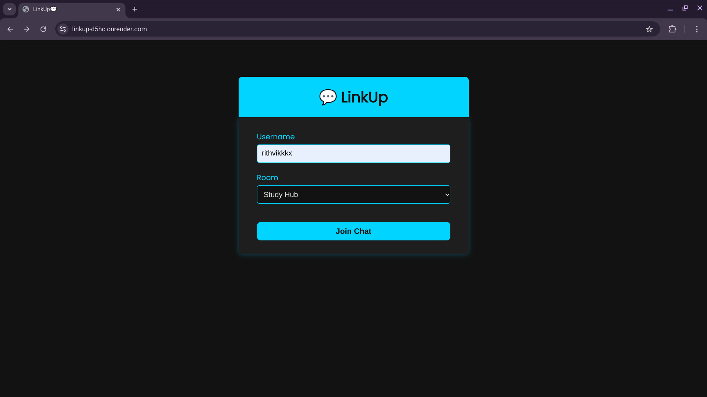
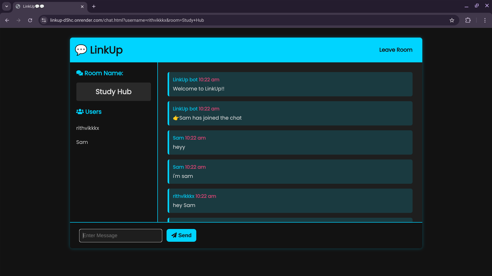
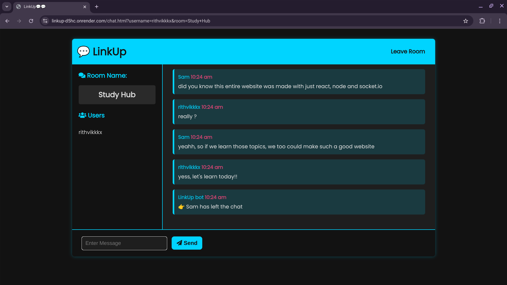

# 💬 LinkUp - Real-Time Chat App  

LinkUp is a real-time chat application built using **Node.js, Express, and Socket.io**. It allows users to join chat rooms and communicate instantly.  

## 📸 Screenshots  
### Home Page  
  

### Chat Room  
  

  

---

## 🚀 Features  
✅ Real-time messaging with **Socket.io**  
✅ Multiple chat rooms for different topics  
✅ Username-based chat system  
✅ Auto-scroll for new messages  
✅ Responsive design for **mobile and desktop**  
✅ Secure user connections  

---

## 🛠 Tech Stack  
- **Frontend:** HTML, CSS, JavaScript  
- **Backend:** Node.js, Express  
- **Real-time:** Socket.io  
- **Deployment:** Render  

---

## 🎮 Live Demo  
🔗 **[Try LinkUp Online](https://linkup-d5hc.onrender.com)**   

---

## 🛀 Installation  

1️⃣ **Clone the repository**  
```sh
git clone https://github.com/rtk5/LinkUp
cd LinkUp
```

2️⃣ **Install dependencies**  
```sh
npm install
```

3️⃣ **Run the server**  
```sh
npm run dev
```

4️⃣ **Open in browser**  
Go to: `http://localhost:3000`

---

## 🌍 Deployment  

### 🔹 **Deploy Backend & Frontend (Render)**  
1. Push your code to **GitHub**.  
2. Go to **[Render](https://render.com/)** → Create **New Web Service**.  
3. Select your GitHub repo, choose **Node.js**, and deploy.  
4. Use the given Render URL to access the app.  

---

## 🤝 Contributing  
Contributions are welcome! To contribute:  
1. **Fork the repository**  
2. **Create a new branch** (`feature-xyz`)  
3. **Commit your changes** (`git commit -m "Added new feature"`)  
4. **Push and create a PR**  

---

## 🐜 License  
This project is licensed under the **MIT License**.  

---

## 🎯 Author  
👨‍💻 **Rithvik Matta**  
🔗 GitHub: [rithvikmatta](https://github.com/rtk585)  

